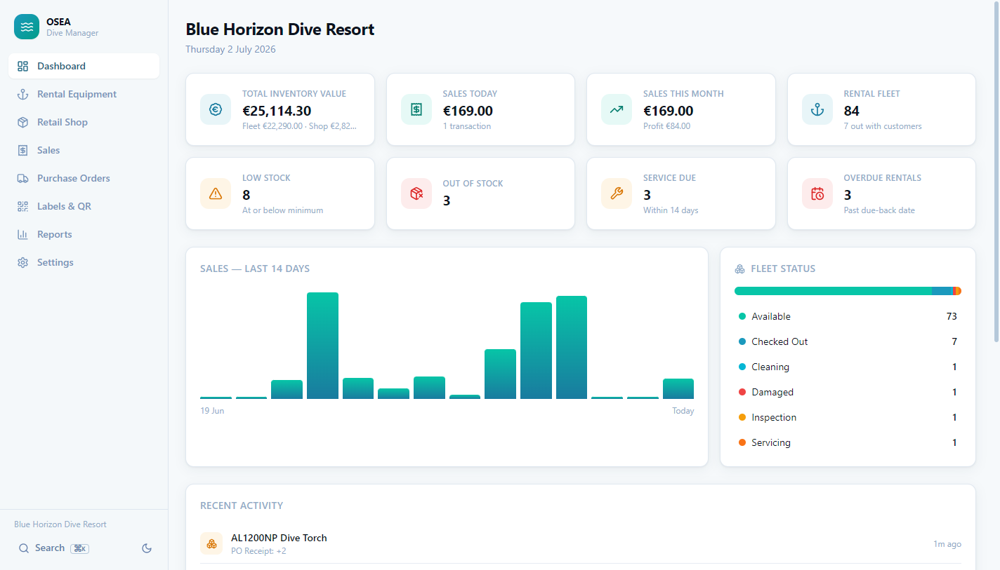

# OSEA Dive Manager

**Professional inventory & rental equipment management for dive centres.**
Version 1.0 — Inventory Module. A product of OSEA Diver Ltd.



## What it is

A standalone, offline-first desktop application (Windows / macOS / Linux) that replaces the
spreadsheets a dive resort runs on:

- **Rental inventory** — every BCD, regulator, cylinder, wetsuit and torch is an individually
  tracked asset with its own number, QR code and *Equipment Passport*: full rental, service,
  inspection and damage history, logged automatically by the workflow.
- **Retail shop inventory** — SKUs, barcodes, cost/retail pricing, VAT, shelf locations,
  min/max levels, and a stock-movement ledger. **Stock never changes without a recorded
  transaction.**
- **Universal QR system** — every item gets a QR code the moment it's created. Scan it (any
  keyboard-wedge USB scanner) anywhere in the app and the record opens instantly. Print labels
  individually or in bulk on A4 sheets, Brother and Zebra thermal rolls, or export to PDF.
- **Sales** — a fast scan-to-sell screen with discounts, VAT, profit tracking and automatic
  stock decrement.
- **Purchase orders** — draft → sent → partial → completed; receiving updates stock and cost
  prices automatically, including a one-click "add all low-stock items" restock.
- **Dashboard & 11 reports** — inventory value, rental utilisation, equipment status, service
  due, sales, profit, suppliers, purchases, damage, low stock, out of stock. Everything
  exports to CSV and prints cleanly.
- **Your data, owned by you** — a single SQLite file in a folder you choose. Backup, restore,
  JSON export/import built in. OSEA hosts nothing and can access nothing.

## Why it exists

The dive industry's incumbents are cloud-tied, complex to set up, and lock into one training
agency's ecosystem. Generic tools are either simple but can't sell (Sortly), powerful but
painful to onboard (Zoho, Fishbowl), or rental-only (Booqable, EZRentOut). OSEA Dive Manager
is purpose-built for dive operations: offline-first for remote resorts, agency-agnostic,
rental *and* retail in one place, and effortless from first launch.

## Quick start (development)

```bash
npm install        # installs deps and rebuilds SQLite for Electron
npm run dev        # launch with hot reload
npm run smoke      # headless end-to-end backend test
npm run dist       # build installers for the current platform
```

First launch shows the setup wizard — choose where your data lives, enter your business
details, and optionally load a complete demo dive centre (84 rental assets, 26 products,
sales history, purchase orders) to explore every feature.

## Documentation

| Document | Contents |
| --- | --- |
| [docs/INSTALLATION.md](docs/INSTALLATION.md) | End-user install + developer setup + building installers |
| [docs/USER-GUIDE.md](docs/USER-GUIDE.md) | Day-to-day workflows: rentals, sales, POs, labels, backups |
| [docs/ARCHITECTURE.md](docs/ARCHITECTURE.md) | Layers, repository pattern, how future modules plug in |
| [docs/DATABASE.md](docs/DATABASE.md) | Full schema reference |

## Technology

Electron · React 18 · TypeScript (strict) · Tailwind CSS · SQLite (better-sqlite3) behind a
provider-agnostic `SqlDriver` / repository layer · electron-vite · electron-builder.

## Keyboard & scanner

- `Ctrl/Cmd + K` — global search (asset numbers, SKUs, barcodes, serials, brands, invoices…)
- Scan any OSEA QR label or product barcode anywhere → the record opens immediately
- Scan into the Sales screen → item added to the basket

## Roadmap (architecture-ready, not yet built)

Equipment servicing module · customer management · bookings · training · boat & compressor
management · customer-owned cloud database adapters (PostgreSQL / MySQL / SQL Server /
Firebase) · Scuba Steve AI integration.

---

© 2026 OSEA Diver Ltd. All rights reserved. See [LICENSE.md](LICENSE.md).
